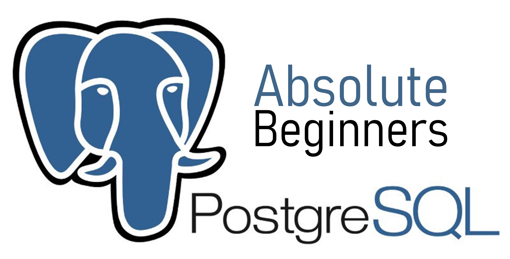

# _PostgreSQL For Absolute Beginners_
We are living in an age of data. In this new era, the person who has more data is more powerful. But he have to utilize his data effectively. For that reason, we use databases to store, manipulate and retrive data as our wish. And PostgreSQL is one of the best database systems available in the industry. It is a powerful, open source object-relational database system with over 30 years of active development that has earned it a strong reputation for reliability, feature robustness, and performance. For these tons of reasons, I have created this repository from where about the basics of PostgreSQL and yes, it is beginner-friendly too.

# Resources that helped me a lot to create this repository:
- FreeCodeCamp's 4 hour Youtube course -> https://www.youtube.com/watch?v=qw--VYLpxG4&t=3355s
- Corey Schafers Youtube channel -> https://www.youtube.com/user/schafer5

# License
Details can be found in [LICENSE](LICENSE)
